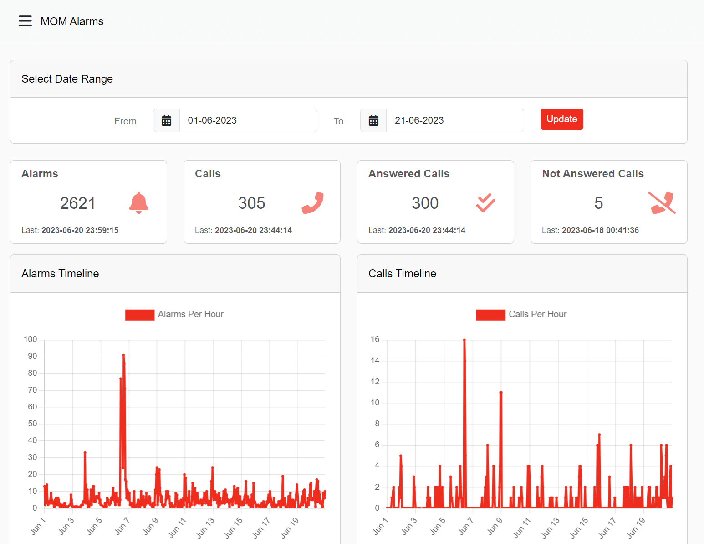
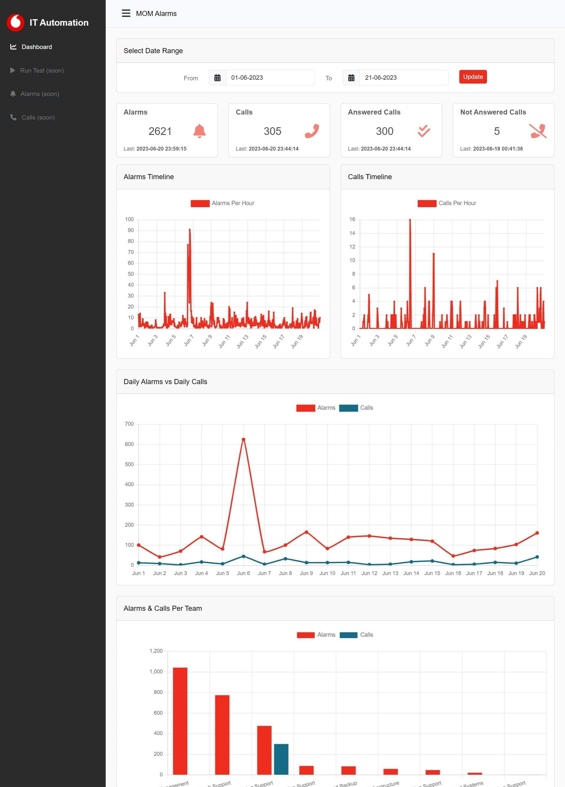

[![LinkedIn][linkedin-shield]][linkedin-url]

<!-- PROJECT LOGO -->
 

  
  <h3 align="center">IT Alarms Automation & Calls Dashboard</h3>

<!-- TABLE OF CONTENTS -->

  
Table of Contents

  <ol>
    <li>
      <a href="#about-the-project">About The Project</a>
      <ul>
        <li><a href="#business-case">Business Case</a></li>
        <li><a href="#technical-solution">Technical Solution</a></li>
        <li><a href="#tech-stack">Tech Stack</a></li>
      </ul>
    </li>
    <li><a href="#contact">Contact</a></li>
  </ol>

<!-- ABOUT THE PROJECT -->
## About The Project

* Project Name: IT Alarms Automation & Calls Dashboard
* Version: v1.0.0
* Organization Department: Technology

### Business Case
The "IT MOM Alarms Automation" project is a strategic 
initiative by IT Automation to enhance the reliability of 
critical IT systems.

The project's core goal is quick identification and 
resolution of critical alarms, achieving efficiency and 
customer satisfaction. Real-time notifications empower 
IT teams to promptly respond to alarms, minimizing 
disruptions.

The IT MOM Alarms and Calls Dashboard is a pivotal part of 
this initiative. It offers a view of the application 
health, revealing alarm patterns, call responses, and 
team performance. Key metrics, including received alarms, 
initiated calls, and call outcomes, empower decision-makers. 

Graphical displays aid in understanding system behavior 
and support proactive actions.

(<a href="#readme-top">back to top</a>)

### Technical Solution
The dashboard in the "IT MOM Alarms and Calls" project 
offers real-time insights into critical alarms and calls. 
It features:

Metrics Overview: Displaying received alarms, initiated 
calls, answered calls, and unanswered calls for a quick 
performance snapshot.

Graphical Timelines: Graphs show alarms and calls hourly, 
aiding in spotting patterns and high-activity periods.

Daily Trends: A graph compares daily alarms and calls, 
revealing potential correlations.

Team Insights: Team-specific stats estimate response efficiency.

Date Range Selection: Users can analyze historical data 
by choosing custom date ranges.

User-Friendly: Designed for easy use across devices.

(<a href="#readme-top">back to top</a>)

### Tech Stack

This project was developed using the following tech stack:

* Python
* Django
* SQL
* HTML
* CSS
* JavaScript
* ChartJs
* Bootstrap

(<a href="#readme-top">back to top</a>)

<!-- CONTACT -->
## Contact

Mohamed AbdelGawad Ibrahim - [@m-abdelgawad](https://www.linkedin.com/in/m-abdelgawad/) - <a href="tel:+201069052620">+201069052620</a>

(<a href="#readme-top">back to top</a>)

<!-- MARKDOWN LINKS & IMAGES -->
<!-- https://www.markdownguide.org/basic-syntax/#reference-style-links -->
[linkedin-shield]: https://img.shields.io/badge/-LinkedIn-black.svg?style=for-the-badge&logo=linkedin&colorB=555
[linkedin-url]: https://www.linkedin.com/in/m-abdelgawad/
